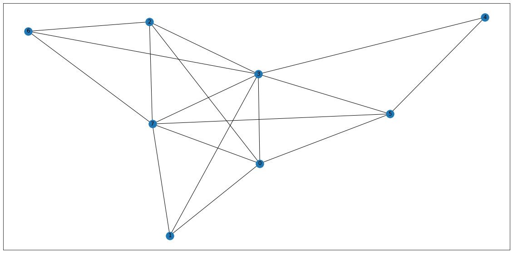
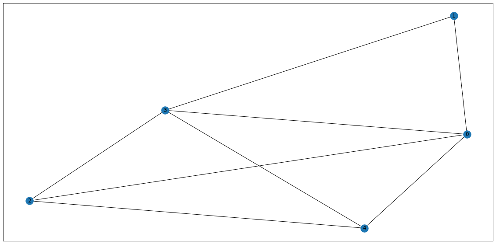

# Generate Random Topology

We first start with a funtion `rand_graph(n)` that creates a random binary adjacecy matrix on $n$ nodes, given that there exists no isolated vertex. The `get_rand_edge_list(n)` generates such a list of edges which is invoked by `rand_graph(n)` to generate a graph in `NetworkX`.


```python
import numpy as np
import random
import networkx as nx
from anytree import AnyNode, RenderTree
import matplotlib.pyplot as plt
plt.rcParams["figure.figsize"] = (20,10)
```


```python
def get_rand_edge_list(n):
    rand_edge_list = []         #to be returned as a list of touples
    for i in range(n):
        count = 0               #to prevent any isolated vertex generation
        while count == 0:
            for j in range(i+1,n):
                if not random.randint(1,100)%2 and i != j: #unif dist + no self-loop
                        rand_edge_list.append((i,j))       #adding to edge list 
                        count+=1                  # a count=0 means isolated vertex       
            if i==j:    #kill the loop when reaches last node
                break
    return rand_edge_list
```


```python
def rand_graph(n):
    topo = nx.Graph()
    topo.add_edges_from( get_rand_edge_list(n) )
    nx.draw_networkx(topo, pos=nx.spring_layout(topo), label=True)
    return topo
```


```python
n = 8  #number of nodes
topo = rand_graph(n)
```





The Adjacecny matrix of the generated topology can be obtianed as following 


```python
adj_mat = np.matrix.tolist(nx.adjacency_matrix(topo).todense())
adj_mat
```


    [[0, 1, 1, 1, 1, 1, 0, 0],
     [1, 0, 0, 1, 0, 1, 0, 0],
     [1, 0, 0, 1, 0, 1, 1, 0],
     [1, 1, 1, 0, 1, 1, 1, 1],
     [1, 0, 0, 1, 0, 1, 0, 1],
     [1, 1, 1, 1, 1, 0, 1, 0],
     [0, 0, 1, 1, 0, 1, 0, 0],
     [0, 0, 0, 1, 1, 0, 0, 0]]


# Generating Graph from real SDN

## initial libraries


```python
import requests
from requests.auth import HTTPBasicAuth
import json
import networkx as nx
import matplotlib.pyplot as plt
plt.rcParams["figure.figsize"] = (20,10)
```

## Connecting to ODL server


```python
def connect_odl(cont_ip, uname, passwd):
    url = f'http://{cont_ip}:8181/restconf/operational/network-topology:network-topology/topology/flow:1'
    return requests.get(url, auth=HTTPBasicAuth(uname, passwd))
```

## Fetching Topology using `topo_sense()`


```python
def topo_sense(cont_ip):
    node_info={}
    link_info=[]

    resp = json.loads(connect_odl(cont_ip=cont_ip,
                       uname='admin',
                       passwd='admin').content.decode()
                     )
    for n in resp['topology'][0]['node']:
        node_id = n["node-id"]
        if node_id.split(':')[0] == 'host':
            mac = n["host-tracker-service:addresses"][0]["mac"]
            ip = n["host-tracker-service:addresses"][0]["ip"]
            node_type = 'host'
        else:
            mac = None
            ip = None
            node_type = 'switch'

        node_info[node_id]= {'mac':mac, 'ip':ip, 'type':node_type}

    for l in resp['topology'][0]['link']:
        link_info.append(  (l["source"]["source-node"], l["destination"]["dest-node"], )  )
    
    return {'Nodes':node_info, 'Links': link_info}
```

## Plotting topology using `topo_plot()`


```python
def topo_plot(cont_ip):
    topo = nx.Graph()
    topo.add_edges_from( topo_sense(cont_ip)['Links'] )
    adj_mat = np.matrix.tolist(nx.adjacency_matrix(topo).todense())
    return topo, nx.draw_networkx(G=topo, pos=nx.spring_layout(topo), label=True)
    return topo
```

## Calling Procedure


```python
def toposense_main():
    odl_topo, p = topo_plot(cont_ip='192.168.1.85')
    plt.show(p)
    print(odl_topo)
```


```python
toposense_main()
```

# Useful Methods to support `mroute()`

## `get_neighbour()`

The `get_neighbour(adj,node)` function neighbours of a given `node` from the adjacency matrix `adj`.


```python
def get_neighbours(adj, node):
    ret = []
    c=0
    for i in adj[node]:
        if i==1:
            ret.append(c)
        c+=1
    return ret
```


```python
get_neighbours(adj_mat, 2)
```


    [1, 3]


## Using `AnyTree()` as a tree builder

A tree detastructure is maintained using `AnyTree` library nodes are stored into a dictionary structure called `tree{}` indexed by heap-indexing i.e. if a node has  index $k$ then its children will be at $nk+1, nk+2...$ given, root at $0$ and $n=|V|$


```python
tree={}
```


```python
tree[0] = AnyNode(id=0, name='B', index=1)
tree[1] = AnyNode(id=1, name='A', parent=tree[0], index=0)
tree[2] = AnyNode(id=2, name='A', parent=tree[0], index=0)
tree[3] = AnyNode(id=3, name='D', parent=tree[0], index=3)
tree[9] = AnyNode(id=9, name='D', parent=tree[2], index=3)
tree[10] = AnyNode(id=10, name='A', parent=tree[2], index=0)
tree[13] = AnyNode(id=13, name='C', parent=tree[3], index=2)
tree[53] = AnyNode(id=53, name='A', parent=tree[13], index=0)

```


```python
print(RenderTree(tree[0]))
```

    AnyNode(id=0, index=1, name='B')
    ├── AnyNode(id=1, index=0, name='A')
    ├── AnyNode(id=2, index=0, name='A')
    │   ├── AnyNode(id=9, index=3, name='D')
    │   └── AnyNode(id=10, index=0, name='A')
    └── AnyNode(id=3, index=3, name='D')
        └── AnyNode(id=13, index=2, name='C')
            └── AnyNode(id=53, index=0, name='A')
    


```python
tree
```


    {0: AnyNode(id=0, index=1, name='B'),
     1: AnyNode(id=1, index=0, name='A'),
     2: AnyNode(id=2, index=0, name='A'),
     3: AnyNode(id=3, index=3, name='D'),
     9: AnyNode(id=9, index=3, name='D'),
     10: AnyNode(id=10, index=0, name='A'),
     13: AnyNode(id=13, index=2, name='C'),
     53: AnyNode(id=53, index=0, name='A')}


## get_ancestors()


```python
def get_ancestors(tree, node):
    ret =[]
    for i in tree[node].ancestors:
        ret.append(i.index)
    return ret
```


```python
get_ancestors(tree,53)
```


    [1, 3, 2]


```python
get_neighbours(adj_mat,0)
```


    [1, 2, 3]


# Building Route-Tree


```python
#list of router IDs
rid_list = ['10.0.0.1', '10.0.1.1',
            '10.0.2.1', '10.0.3.1', '10.0.4.1'] 
```

## Recalculate topology


```python
n=len(rid_list)
topo = rand_graph(n)
adj_mat = np.matrix.tolist(nx.adjacency_matrix(topo).todense())
```





## Building initial data-structures


```python
node_map= {} 
for i in range(len(rid_list)):
        node_map[i]=rid_list[i]
```


```python
node_map
```


    {0: '10.0.0.1', 1: '10.0.1.1', 2: '10.0.2.1', 3: '10.0.3.1', 4: '10.0.4.1'}


```python
mtree={}
```

## `mroute()` algorithm


```python
def mroute(_id, s, d, n, info):
    '''
        Task: Generates all possible paths between Source (S), Destination (D)
        
        Parameters
        ----------
            _id : initialise as 0
            s   : index of the source node
            d   : index of the destinattion node
            n   : number of nodes in the topology
            info: Boolean, if debug info is needed
    '''
    if info:
        print('\nVisiting',node_map[d])
    
    if s == d:                                 #successfull termination
        if info:
            print('S_term\n')
        return
    
    if _id == 0:                                #initialization
        if info:
            print('\t init')
        #adding root node    
        mtree[_id] = AnyNode(id=_id, 
                             name=node_map[d], 
                             index=d)
    
    nei_set = set( get_neighbours(adj_mat,d) )  #neighbour set
    ans_set = set( get_ancestors( mtree, _id )) #ancesotr set 
    
    if info:
        print('\t neighbours: ',nei_set)
        print('\t ancestors : ',ans_set)
     
    children = list(nei_set.difference( ans_set ) )   # CH = [ {NEI} - {ANS} ]
    
    if info:
        print('\t children  : ',children)
    

    c=1 # cid = id*n + c | c = [1,2,3...] heap indexing
    for k in children:
        cid = n*_id + c   
        c+=1

        #Adding children
        mtree[cid] = AnyNode(id=cid, 
                             name=node_map[k], 
                             parent=mtree[_id], 
                             index=k )
        mroute(cid, s, k, n, info) #recursion
    
    if children == []:          # CH = NULL Set => Unsuccessful termination
        if info:
            print('U_term\n')
        return 
```

Lets run `mroute(_id, s, d, n, info)` now, this is a recursive algorithm hence start with base condition `_id=0` this enures the heap indexing starts with 0 also, internally it initiates the tree building. `s=4, d=1` sets source and destination nodes are at index 4 and 1 respectively in the adjacency matrix. `n=5` is the number of nodes in the graph and finally, `info=True` prints the debug information. 

## Running `mroute()` Grow-phase


```python
mroute(_id=0, s=1, d=4, n=5, info=True)
```

    
    Visiting 10.0.4.1
    	 init
    	 neighbours:  {0, 2, 3}
    	 ancestors :  set()
    	 children  :  [0, 2, 3]
    
    Visiting 10.0.0.1
    	 neighbours:  {1, 2, 3, 4}
    	 ancestors :  {4}
    	 children  :  [1, 2, 3]
    
    Visiting 10.0.1.1
    S_term
    
    
    Visiting 10.0.2.1
    	 neighbours:  {0, 3, 4}
    	 ancestors :  {0, 4}
    	 children  :  [3]
    
    Visiting 10.0.3.1
    	 neighbours:  {0, 1, 2, 4}
    	 ancestors :  {0, 2, 4}
    	 children  :  [1]
    
    Visiting 10.0.1.1
    S_term
    
    
    Visiting 10.0.3.1
    	 neighbours:  {0, 1, 2, 4}
    	 ancestors :  {0, 4}
    	 children  :  [1, 2]
    
    Visiting 10.0.1.1
    S_term
    
    
    Visiting 10.0.2.1
    	 neighbours:  {0, 3, 4}
    	 ancestors :  {0, 3, 4}
    	 children  :  []
    U_term
    
    
    Visiting 10.0.2.1
    	 neighbours:  {0, 3, 4}
    	 ancestors :  {4}
    	 children  :  [0, 3]
    
    Visiting 10.0.0.1
    	 neighbours:  {1, 2, 3, 4}
    	 ancestors :  {2, 4}
    	 children  :  [1, 3]
    
    Visiting 10.0.1.1
    S_term
    
    
    Visiting 10.0.3.1
    	 neighbours:  {0, 1, 2, 4}
    	 ancestors :  {0, 2, 4}
    	 children  :  [1]
    
    Visiting 10.0.1.1
    S_term
    
    
    Visiting 10.0.3.1
    	 neighbours:  {0, 1, 2, 4}
    	 ancestors :  {2, 4}
    	 children  :  [0, 1]
    
    Visiting 10.0.0.1
    	 neighbours:  {1, 2, 3, 4}
    	 ancestors :  {2, 3, 4}
    	 children  :  [1]
    
    Visiting 10.0.1.1
    S_term
    
    
    Visiting 10.0.1.1
    S_term
    
    
    Visiting 10.0.3.1
    	 neighbours:  {0, 1, 2, 4}
    	 ancestors :  {4}
    	 children  :  [0, 1, 2]
    
    Visiting 10.0.0.1
    	 neighbours:  {1, 2, 3, 4}
    	 ancestors :  {3, 4}
    	 children  :  [1, 2]
    
    Visiting 10.0.1.1
    S_term
    
    
    Visiting 10.0.2.1
    	 neighbours:  {0, 3, 4}
    	 ancestors :  {0, 3, 4}
    	 children  :  []
    U_term
    
    
    Visiting 10.0.1.1
    S_term
    
    
    Visiting 10.0.2.1
    	 neighbours:  {0, 3, 4}
    	 ancestors :  {3, 4}
    	 children  :  [0]
    
    Visiting 10.0.0.1
    	 neighbours:  {1, 2, 3, 4}
    	 ancestors :  {2, 3, 4}
    	 children  :  [1]
    
    Visiting 10.0.1.1
    S_term
    
    

Lets see the actual tree built by mroute, this is the result of __Grow__ phase, therefore some unreachable paths (i.e. paths ending with non-source nodes are visible), which will be removed in the next phase. 


```python
print(RenderTree(mtree[0]).by_attr('name'))
```

    10.0.4.1
    ├── 10.0.0.1
    │   ├── 10.0.1.1
    │   ├── 10.0.2.1
    │   │   └── 10.0.3.1
    │   │       └── 10.0.1.1
    │   └── 10.0.3.1
    │       ├── 10.0.1.1
    │       └── 10.0.2.1
    ├── 10.0.2.1
    │   ├── 10.0.0.1
    │   │   ├── 10.0.1.1
    │   │   └── 10.0.3.1
    │   │       └── 10.0.1.1
    │   └── 10.0.3.1
    │       ├── 10.0.0.1
    │       │   └── 10.0.1.1
    │       └── 10.0.1.1
    └── 10.0.3.1
        ├── 10.0.0.1
        │   ├── 10.0.1.1
        │   └── 10.0.2.1
        ├── 10.0.1.1
        └── 10.0.2.1
            └── 10.0.0.1
                └── 10.0.1.1
    

## Running `mroute()` Shrink-phase

The __Shrink__ phase follows the tree generation and collects only valid paths (i.e. ending with source nodes), a collection of such paths indexed by the source node is retuned by the `get_route_vector(s,d)` funtion called the __Route-Vector__. Finally all the index and RID sequences are reverted to compansate the back-tracking. Notice all routes have ientical initialand terminal values, demostrating the all possuible paths between a pair.


```python
def get_route_vectors(s,d):
    route_vector={'src':node_map[s],
                  'dst':node_map[d],
                  'routes_by_idx':[],
                  'routes_by_rid':[],
                  'edge_list':[]
                 }
    
    #filtering valid paths only
    for i in mtree[0].leaves:
        if( i.name == node_map[s] ):   #if the leaf is the source node, valid route
            route_vector['routes_by_idx'].append([x.index for x in mtree[i.id].ancestors])
            route_vector['routes_by_rid'].append([x.name for x in mtree[i.id].ancestors])
    
    #appending the leaf node and reverse, helps in finding next hop 
    for i in route_vector['routes_by_idx']:
        i.append(s)
        i=i.reverse()
    for i in route_vector['routes_by_rid']:
        i.append(node_map[s])
        i=i.reverse()
        
    # returns list of edges for calculating costs in O(1)
    for route in route_vector['routes_by_idx']:
        e_list=[]
        for i in range(len(route)-1):
            e_list.append((route[i],route[i+1]))
        route_vector['edge_list'].append(e_list)
     
    return route_vector
```


```python
rvector=get_route_vectors(s=1, d=4)
```


```python
rvector
```


    {'src': '10.0.1.1',
     'dst': '10.0.4.1',
     'routes_by_idx': [[1, 0, 4],
      [1, 3, 2, 0, 4],
      [1, 3, 0, 4],
      [1, 0, 2, 4],
      [1, 3, 0, 2, 4],
      [1, 0, 3, 2, 4],
      [1, 3, 2, 4],
      [1, 0, 3, 4],
      [1, 3, 4],
      [1, 0, 2, 3, 4]],
     'routes_by_rid': [['10.0.1.1', '10.0.0.1', '10.0.4.1'],
      ['10.0.1.1', '10.0.3.1', '10.0.2.1', '10.0.0.1', '10.0.4.1'],
      ['10.0.1.1', '10.0.3.1', '10.0.0.1', '10.0.4.1'],
      ['10.0.1.1', '10.0.0.1', '10.0.2.1', '10.0.4.1'],
      ['10.0.1.1', '10.0.3.1', '10.0.0.1', '10.0.2.1', '10.0.4.1'],
      ['10.0.1.1', '10.0.0.1', '10.0.3.1', '10.0.2.1', '10.0.4.1'],
      ['10.0.1.1', '10.0.3.1', '10.0.2.1', '10.0.4.1'],
      ['10.0.1.1', '10.0.0.1', '10.0.3.1', '10.0.4.1'],
      ['10.0.1.1', '10.0.3.1', '10.0.4.1'],
      ['10.0.1.1', '10.0.0.1', '10.0.2.1', '10.0.3.1', '10.0.4.1']],
     'edge_list': [[(1, 0), (0, 4)],
      [(1, 3), (3, 2), (2, 0), (0, 4)],
      [(1, 3), (3, 0), (0, 4)],
      [(1, 0), (0, 2), (2, 4)],
      [(1, 3), (3, 0), (0, 2), (2, 4)],
      [(1, 0), (0, 3), (3, 2), (2, 4)],
      [(1, 3), (3, 2), (2, 4)],
      [(1, 0), (0, 3), (3, 4)],
      [(1, 3), (3, 4)],
      [(1, 0), (0, 2), (2, 3), (3, 4)]]}


## Building Cost_Matrix

We simulate the load distribution of the link by element wise multiplying the binary adjacency matrix `adj_mat` by a random matrix, uniformly distributed $\sim [0,1]$, that denotes cost between $[0,1]$. running the follwoing code in loop simulates a varying cost network. 


```python
cost_mat = np.multiply(np.matrix(adj_mat),np.random.rand(5,5))
cost_mat
```


    matrix([[0.        , 0.91229379, 0.55141201, 0.43848989, 0.32947017],
            [0.82183805, 0.        , 0.        , 0.99356067, 0.        ],
            [0.71687208, 0.        , 0.        , 0.30229846, 0.18049757],
            [0.22335493, 0.54020668, 0.01348037, 0.        , 0.04047966],
            [0.04364624, 0.        , 0.13455626, 0.85426279, 0.        ]])


```python
cost_mat.item((1,0))
```


    0.8218380472581878


```python
def route_rank(cost_matrix, r_vector):
    import collections
    
    costs = {}
    for idx in range(len(r_vector['edge_list'])):
        sum = 0
        for e in r_vector['edge_list'][idx]:
            sum += cost_matrix.item(e)
        costs[round(sum,3)]=r_vector['edge_list'][idx]
        
    return collections.OrderedDict(sorted(costs.items()))
```


```python
ranked_routes = route_rank(cost_matrix=cost_mat, r_vector=rvector)
```


```python
ranked_routes
```


    OrderedDict([(1.034, [(1, 3), (3, 4)]),
                 (1.151, [(1, 0), (0, 4)]),
                 (1.188, [(1, 3), (3, 2), (2, 4)]),
                 (1.301, [(1, 0), (0, 3), (3, 4)]),
                 (1.454, [(1, 0), (0, 3), (3, 2), (2, 4)]),
                 (1.546, [(1, 3), (3, 0), (0, 4)]),
                 (1.554, [(1, 0), (0, 2), (2, 4)]),
                 (1.716, [(1, 0), (0, 2), (2, 3), (3, 4)]),
                 (1.949, [(1, 3), (3, 0), (0, 2), (2, 4)]),
                 (2.053, [(1, 3), (3, 2), (2, 0), (0, 4)])])


```python
def get_best(ranked_routes):
    cost = next(iter(ranked_routes))
    return {'cost': cost, 'path': ranked_routes[cost]}
```


```python
get_best(ranked_routes)
```


    {'cost': 1.034, 'path': [(1, 3), (3, 4)]}


