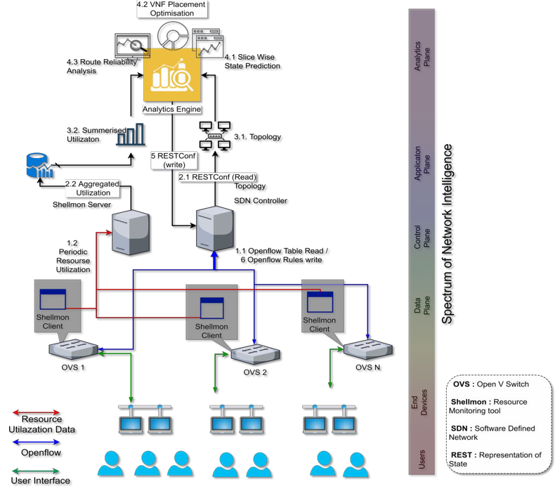
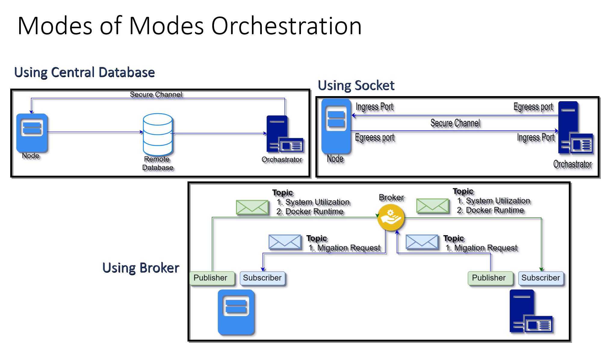

# SO-KDN
## Self Organised Knowledge Defined Netwrok Architecture

 
## _Detailed implementation is being updated on __Intelligent Overlay.ipynb__ file_  

# Self-Organised Knowledge Defined Networks (SO-KDN)
SO-KDN is a overlay SDN running on top of a non-SDN network. the custom Control plane __pulls__ the information from the infrastructure-plane,
__aggregates___ it and store into a a datastructure compatible for __high speed query__ such as Elastic or Pandas Dataframe. Also unlike 
standard SDN it __learns__ from the pulled data. Knoledge aquired from the learning is __reinforced__ back to the infrastructure plane by
__injecting__ configuration commands. 

## Some properties of SO-KDN
1. __Not a Pure SDN__ : the infrastructure doesn't completely decouple the data plane from the control plane of the network devices.
rather the control place is now segmented into two parts. One that runs within the device with a closed coupled forwarding plane, the other 
runs for aggregation and to get a global view of the network. This allows a existing Non-SDN infrastructure to leverage the SDN benifits without 
migrating into it. we term them: __Overlay & Underlay Control plane__.

2. __Self Organisation__ : Self organisation in 4G had 3major features _self-Optimisation, self-Configuration & self-healing_ whereas on 5G
the fouth piller _self-Learning_ is introduced. to adapt the change SO-KDN also allowes ML/DL integration with overlay. preferable learning mechanism being __Online Deep Reinforement Learning__ 

3. __Scalability__ : SO-KDN is designed with a multithreaded Model where each network device is represed by an object running on its own thread. (please see the effect on the _intelligent SDN.ipynb_ file 

4. __Communication Flexibility__ : The communication between the Underlay & Overlay can be done in various ways based on the needs.

> * Databse Driven  : for analysing a large pool of Data and communication with bigdata framework like hadoop
> * Socket Based    : where data is temporal for online learning only 
> * Hybrid          : A combination of both, Underlay sends over socket and Overlay stores into a Database
> * Broker Based    : Using MQTT/AMQP broker for better synchronisation, managibility and discovery 

5. __Programibility__ : Since the Framework aggregates the entire network into a graph structure, custom algorithms can be easily developped and compared for agile development and prototype purpose. 
